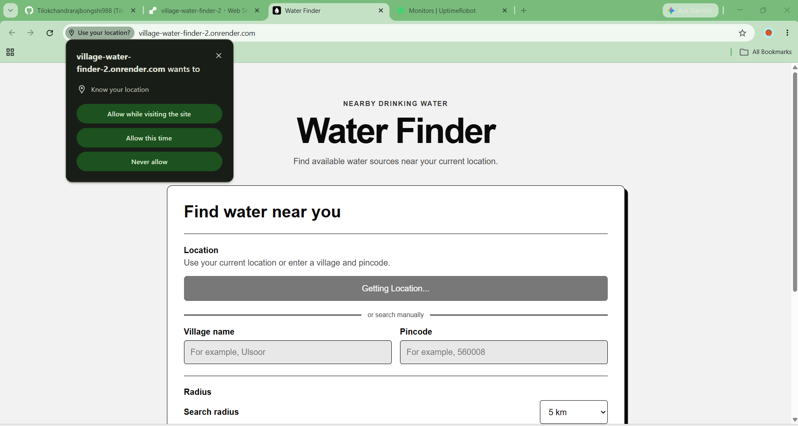
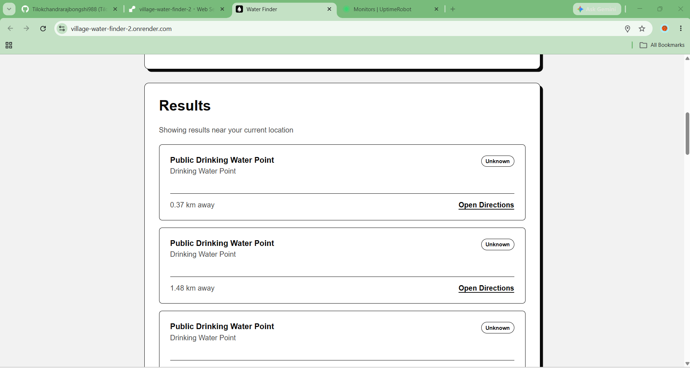
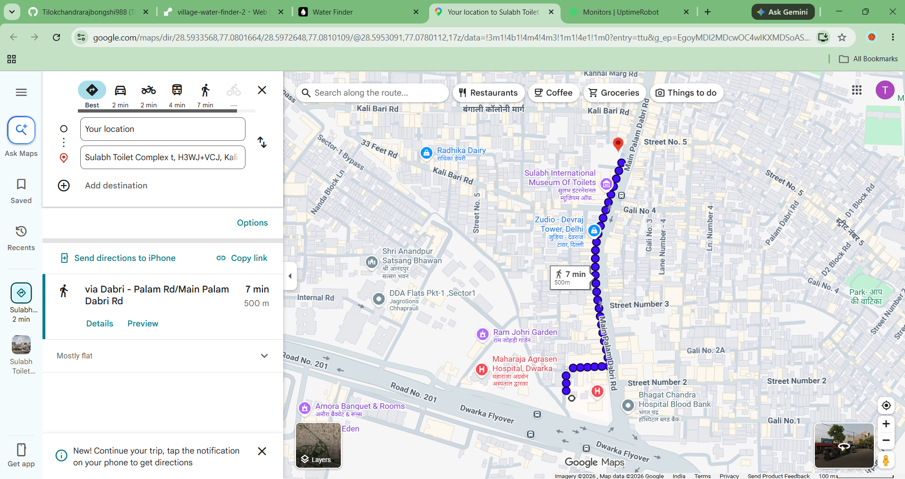

# Water Finder

Water Finder is a responsive full-stack web application that helps people discover mapped public drinking-water points near a current location or a searched village and pincode. It uses live community-contributed OpenStreetMap data instead of maintaining a private database of hardcoded locations.

**Live demo:** [village-water-finder-2.onrender.com](https://village-water-finder-2.onrender.com)

> **India-focused project:** Manual search is designed for Indian locations and requires a village name with a six-digit Indian pincode. Current-location search returns nearby points when matching OpenStreetMap data is available.

## Screenshots

### Location permission and search form



### Nearby results



### Open Directions



## The real-life problem

Finding a public drinking-water point can be difficult when someone is travelling, walking through an unfamiliar area, or does not know the local facilities. Ordinary map searches may also mix drinking-water sources with unrelated wells, fountains, or commercial water sellers.

Water Finder provides a focused workflow:

1. Detect the user's current location, or accept a village name and six-digit Indian pincode.
2. Search within a selected radius of 2, 5, or 10 kilometres.
3. Find OpenStreetMap features explicitly mapped as drinking water.
4. Sort the results from nearest to farthest.
5. Open turn-by-turn directions to a selected point in Google Maps.

This project does not claim that a source is currently working or independently verify water quality. It helps users discover locations mapped by OpenStreetMap contributors.

## Features

- Browser-based location detection, requested only after a button click
- Manual village and pincode search
- Search radii of 2 km, 5 km, and 10 km
- Nearby drinking-water data from OpenStreetMap
- Results ordered by distance
- Distance rounded to two decimal places
- Google Maps directions without a Google Maps API key
- Loading, validation, permission, empty-result, and API-error states
- Coordinates kept only in React state and never stored
- Responsive black-and-white interface for desktop, tablet, and mobile
- No MongoDB database and no hardcoded water-source records

## How it works

### Manual search

```text
Village + pincode
        ↓
Nominatim converts the place into coordinates
        ↓
Overpass searches nearby OpenStreetMap drinking-water features
        ↓
Express formats and sorts the results
        ↓
React displays the result cards
```

### Current-location search

```text
Browser geolocation
        ↓
Overpass searches around the coordinates
        ↓
Express formats and sorts the results
        ↓
React displays the result cards
```

The Overpass query includes features tagged as:

```text
amenity=drinking_water
drinking_water=yes
```

## Tech stack

### Frontend

- React
- Vite
- JavaScript and JSX
- Plain CSS
- Browser Geolocation API

### Backend

- Node.js
- Express
- Nominatim Search API
- Overpass API

### Deployment

- Render Web Service
- Express serves the production React build

## Project structure

```text
frontend/
├── public/
├── src/
│   ├── components/
│   ├── hooks/
│   ├── pages/
│   ├── services/
│   ├── App.jsx
│   ├── index.css
│   └── main.jsx
└── package.json

backend/
├── controllers/
├── routes/
├── services/
└── server.js
```

## API routes

### Health check

```http
GET /api/health
```

### Search by village and pincode

```http
GET /api/water-sources/search?village=Ulsoor&pincode=560008&radius=5
```

Required query parameters:

- `village`
- `pincode` — six digits
- `radius` — `2`, `5`, or `10`

### Search using browser coordinates

```http
GET /api/water-sources/nearby?lat=12.9778&lng=77.6246&radius=5
```

Required query parameters:

- `lat`
- `lng`
- `radius` — `2`, `5`, or `10`

Example response:

```json
{
  "success": true,
  "searchedLocation": "your current location",
  "count": 2,
  "waterSources": [],
  "attribution": "OpenStreetMap contributors"
}
```

## Run locally

### Requirements

- Node.js 22.12 or newer
- npm

### 1. Install backend dependencies

From the project root:

```bash
npm install
```

### 2. Install frontend dependencies

```bash
npm install --prefix frontend
```

### 3. Configure local development

Create a root `.env` file:

```env
NODE_ENV=development
PORT=5000
CLIENT_URL=http://localhost:5173
```

Create `frontend/.env`:

```env
VITE_API_URL=http://localhost:5000
```

Do not commit real `.env` files.

### 4. Start the backend

```bash
npm run server
```

### 5. Start the frontend

In another terminal:

```bash
npm run dev --prefix frontend
```

Open [http://localhost:5173](http://localhost:5173).

If PowerShell blocks `npm`, use `npm.cmd` instead.

## Production build

```bash
npm run build
npm start
```

In production, Express serves `frontend/dist`, so the frontend and API use the same domain.

## Deploy on Render

Create one Render Web Service with:

```text
Language: Node
Build Command: npm run build
Start Command: npm start
Health Check Path: /api/health
```

Add this environment variable:

```env
NODE_ENV=production
```

Render supplies `PORT` automatically. No MongoDB connection, JWT secret, or third-party API key is required.

## Privacy

- Location access is requested only when the user clicks **Use My Location**.
- Exact coordinates are not displayed in the interface.
- Coordinates remain in React state and are not saved to localStorage or a database.
- Coordinates are sent to the backend only to perform the requested nearby search.

## Data source and attribution

Water-source and place information comes from OpenStreetMap services:

- [OpenStreetMap](https://www.openstreetmap.org/)
- [Nominatim](https://nominatim.openstreetmap.org/)
- [Overpass API](https://overpass-api.de/)

Data © [OpenStreetMap contributors](https://www.openstreetmap.org/copyright).

## Limitations

- Results depend on what contributors have mapped in OpenStreetMap.
- Some areas may have incomplete or no drinking-water data.
- Names, addresses, and operational status may be unavailable.
- A mapped point is not a real-time guarantee of availability or water quality.
- Public OpenStreetMap services have fair-use limits and are not intended for heavy production traffic.

## Author

Created by Tilok.
